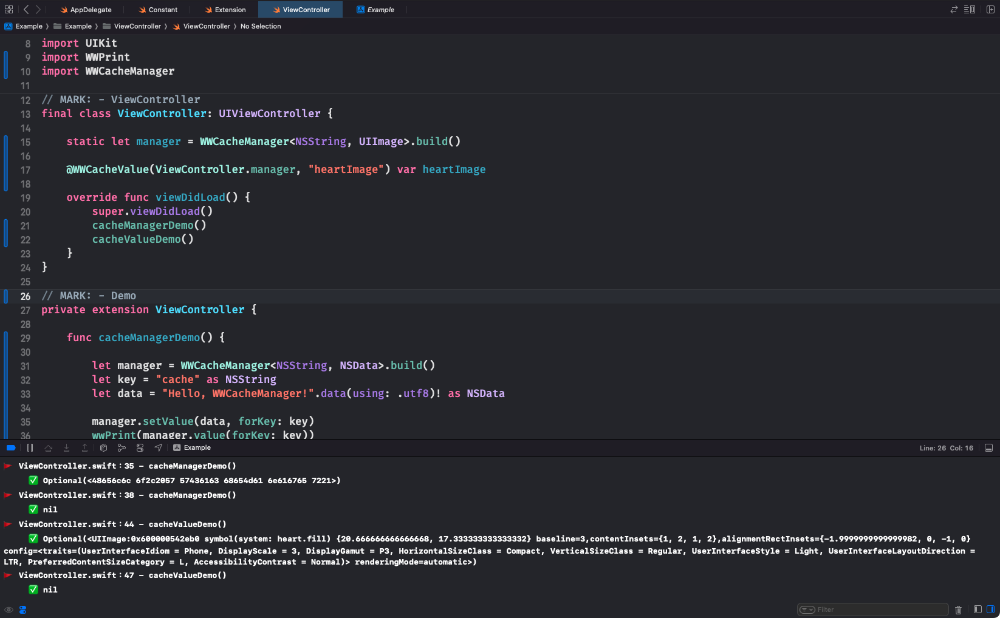

# WWCacheManager
[](https://developer.apple.com/swift/) [](https://developer.apple.com/swift/)  [](https://developer.apple.com/swift/) [](https://developer.apple.com/swift/)

## [Introduction - 簡介](https://swiftpackageindex.com/William-Weng)
- [Make the NSCache function easier to use.](https://juejin.cn/post/6844903810528182280)
- [將NSCache功能變的更簡單使用。](https://medium.com/@master13sust/to-nscache-or-not-to-nscache-what-is-the-urlcache-35a0c3b02598)



### [Installation with Swift Package Manager](https://medium.com/彼得潘的-swift-ios-app-開發問題解答集/使用-spm-安裝第三方套件-xcode-11-新功能-2c4ffcf85b4b)
```js
dependencies: [
    .package(url: "https://github.com/William-Weng/WWCacheManager.git", .upToNextMajor(from: "1.0.1"))
]
```

### [Function - 可用函式](https://platform.openai.com/)
|函式|功能|
|-|-|
|build(countLimit:totalCostLimit:delegate:)|建立WWCacheManager|
|setValue(_ :forKey:)|設定數值|
|value(forKey:)|讀取數值|
|removeValue(forKey:)|移除數值|
|removeAll()|移除全部的數值|
|@WWCacheValue|修飾字|

### Example - 範例
```swift
import UIKit
import WWPrint
import WWCacheManager

final class ViewController: UIViewController {

    static let manager = WWCacheManager<NSString, UIImage>.build()
    
    @WWCacheValue(ViewController.manager, "heartImage") var heartImage
    
    override func viewDidLoad() {
        super.viewDidLoad()
        cacheManagerDemo()
        cacheValueDemo()
    }
}

private extension ViewController {
    
    func cacheManagerDemo() {
        
        let manager = WWCacheManager<NSString, NSData>.build()
        let key = "cache" as NSString
        let data = "Hello, WWCacheManager!".data(using: .utf8)! as NSData
        
        manager.setValue(data, forKey: key)
        wwPrint(manager.value(forKey: key))
        
        manager.removeValue(forKey: key)
        wwPrint(manager.value(forKey: key))
    }
    
    func cacheValueDemo() {
                
        heartImage = UIImage(systemName: "heart.fill")
        wwPrint(heartImage)
        
        heartImage = nil
        wwPrint(heartImage)
    }
}
```
